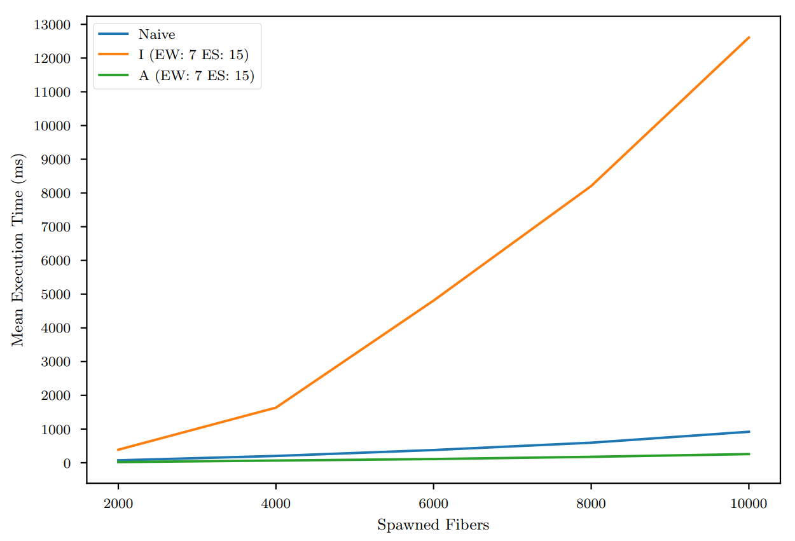
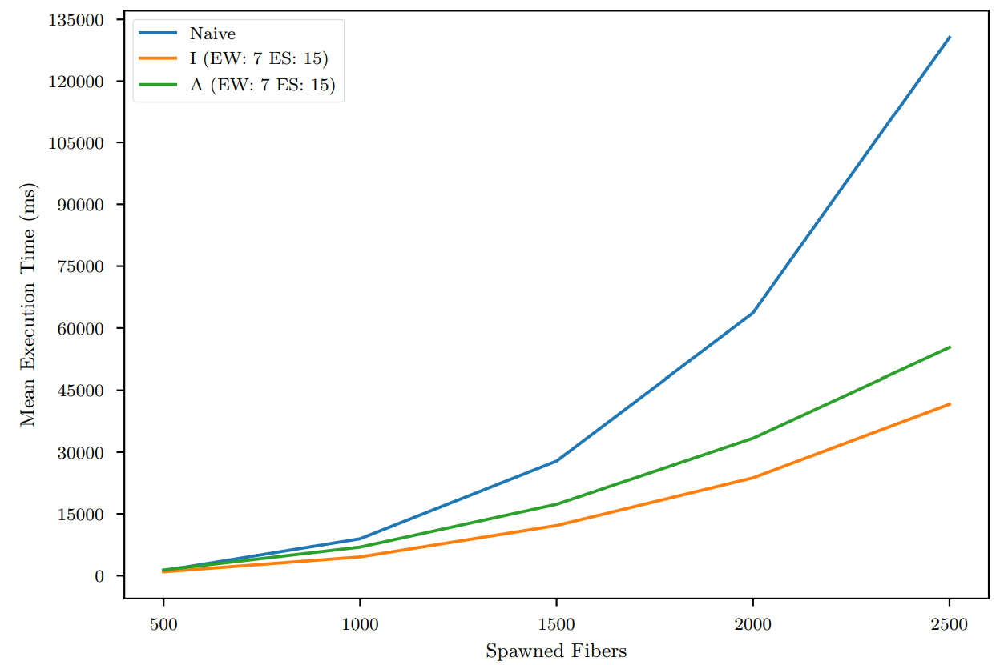
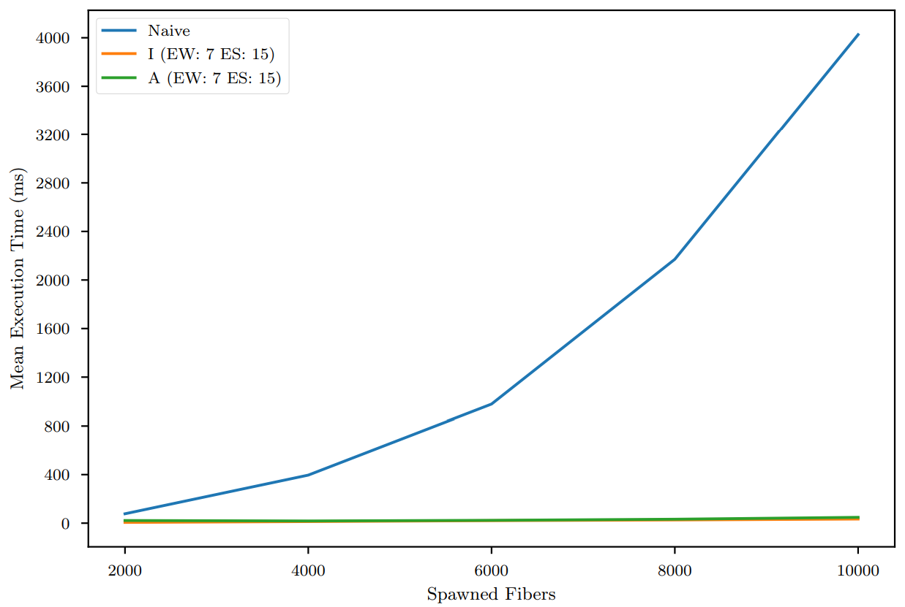
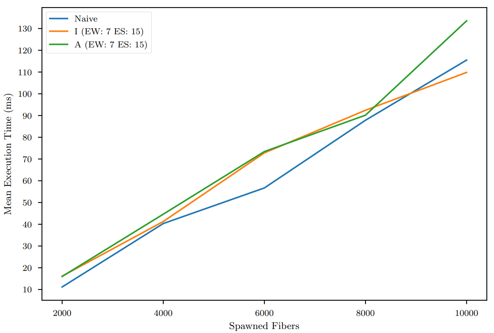

<a id="readme-top"></a>

[![Contributors][contributors-shield]][contributors-url]
[![Forks][forks-shield]][forks-url]
[![Stargazers][stars-shield]][stars-url]
[![Issues][issues-shield]][issues-url]
[![MIT License][license-shield]][license-url]
[![NuGet][nuget-shield]][nuget-url]


<br />
<div align="center">
  <a href="https://github.com/fio-fsharp/fio">
    
  </a>

  <h3 align="center">🪻 A Type-Safe, Purely Functional Effect System for Asynchronous and Concurrent F#</h3>

  <p align="center">
    <!-- An awesome README template to jumpstart your projects! -->
    <br />
    <a href="https://github.com/fio-fsharp/fio"><strong>Explore the docs »</strong></a>
    <br />
    <br />
    <a href="https://iyyel.io/projects/fio/">View Post</a>
    &middot;
    <a href="https://github.com/fio-fsharp/fio/issues/new?labels=bug&template=bug-report---.md">Report Bug</a>
    &middot;
    <a href="https://github.com/fio-fsharp/fio/issues/new?labels=enhancement&template=feature-request---.md">Request Feature</a>
  </p>
</div>


<details>
  <summary>Table of Contents</summary>
  <ol>
    <li>
      <a href="#about-the-project">About The Project</a>
      <ul>
        <li><a href="#built-with">Built With</a></li>
      </ul>
    </li>
    <li>
      <a href="#getting-started">Getting Started</a>
      <ul>
        <li><a href="#prerequisites">Prerequisites</a></li>
        <li><a href="#installation">Installation</a></li>
      </ul>
    </li>
    <li><a href="#usage">Usage</a></li>
    <li><a href="#roadmap">Roadmap</a></li>
    <li><a href="#contributing">Contributing</a></li>
    <li><a href="#license">License</a></li>
    <li><a href="#contact">Contact</a></li>
    <li><a href="#acknowledgments">Acknowledgments</a></li>
  </ol>
</details>


## About FIO

<!-- [![Product Name Screen Shot][product-screenshot]](https://example.com) !-->

**FIO** is a type-safe, purely functional effect system for [**F#**](https://fsharp.org/), designed for building **highly concurrent** and **asynchronous** applications. It provides a lightweight [**DSL**](https://martinfowler.com/dsl.html) for writing composable programs using functional effects.

Inspired by [**ZIO**](https://zio.dev/) and [**Cats Effect**](https://typelevel.org/cats-effect/), **FIO** features:

- An **IO monad** for managing side effects  
- **Fibers** (green threads) for scalable concurrency  
- A focus on **purity**, **type safety**, and **performance**

FIO was developed as part of a master’s thesis in Computer Science at [**DTU**](https://www.dtu.dk/english). [**Read the thesis**](https://iyyel.io/assets/doc/masters_thesis_daniel_larsen.pdf) (some parts may be outdated).

> **Note:** **FIO** is under active development. Contributions, feedback, and questions are very welcome!  
> Feel free to report bugs, request features or [reach out](mailto:daniel@iyyel.io).


<p align="right">(<a href="#readme-top">back to top</a>)</p>


### Built With

* [![FSharp][FSharp]][FSharp-url]
* [![.NET][.NET]][.NET-url]

<p align="right">(<a href="#readme-top">back to top</a>)</p>


<!-- GETTING STARTED -->
## Getting Started

Getting started with **FIO** is simple:

1. Install [.NET](https://dotnet.microsoft.com/en-us/)
2. Use an editor like [VS Code](https://code.visualstudio.com/), [Visual Studio](https://visualstudio.microsoft.com/downloads/), or [Rider](https://www.jetbrains.com/rider/download/) 
3. Clone this repository
4. Open it in your editor
5. Explore the [**FIO.Examples**](https://github.com/fio-fsharp/fio/tree/dev/src/FIO.Examples) project or create your own F# file

### Usage

You can use **FIO** in two ways:  
- **Directly** by creating and running effects manually  
- Via **`FIOApp`**, which simplifies setup and runtime management

### Direct Usage

Create a new F# file and open the DSL, IO and Concurrent runtime modules:

```fsharp
module DirectUsage

open FIO.DSL
open FIO.Lib.IO
open FIO.Runtime.Concurrent

[<EntryPoint>]
let main _ =
    let askForName = fio {
        do! FConsole.PrintLine "Hello! What is your name?"
        let! name = FConsole.ReadLine ()
        do! FConsole.PrintLine $"Hello, %s{name}! Welcome to FIO! 🪻💜"
    }

    let fiber = Runtime().Run askForName
    let result = fiber.AwaitAsync ()
    printfn $"%A{result}"
    exit 0
```

Run it with:

```
$ dotnet run
```

And you'll see the following output:

```
Hello! What is your name?
Daniel
Hello, Daniel, welcome to FIO! 🪻💜
Ok ()
```

### Using FIOApp (Recommended)

Wrap your effect in a `FIOApp` to simplify boilerplate. Open the App module:

```fsharp
module FIOAppUsage

open FIO.DSL
open FIO.Lib.IO
open FIO.App

type WelcomeApp() =
    inherit FIOApp<unit, obj>()

    override this.effect = fio {
        do! FConsole.PrintLine "Hello! What is your name?"
        let! name = FConsole.ReadLine ()
        do! FConsole.PrintLine $"Hello, %s{name}! Welcome to FIO! 🪻💜"
    }

WelcomeApp().Run()
```

Same execution as before:

```
$ dotnet run
```

and same output as well:

```
Hello! What is your name?
Daniel
Hello, Daniel, welcome to FIO! 🪻💜
Ok ()
```

### Alternative: DSL-Only Style

Prefer DSL chaining? Use bind (>>=) directly:

```fsharp
module DSLOnly

open FIO.DSL
open FIO.Lib.IO

let askForName =
    FConsole.PrintLine "Hello! What is your name?" >>= fun _ ->
    FConsole.ReadLine () >>= fun name ->
    FConsole.PrintLine $"Hello, %s{name}, welcome to FIO! 🪻💜"
```


## Benchmarks

This repository includes five benchmarks, each designed to evaluate a specific aspect of concurrent computation. All benchmarks are adapted from the [**Savina – An Actor Benchmark Suite**](http://soft.vub.ac.be/AGERE14/papers/ageresplash2014_submission_19.pdf).

### Benchmark Overview

- **Pingpong** – Message sending and retrieval between two actors  
- **Threadring** – Message passing with frequent fiber context switching  
- **Big** – Many-to-many message passing with high channel contention  
- **Bang** – Many-to-one messaging, stressing a single receiver  
- **Fork** – Measures fiber spawning overhead

### Running Benchmarks

The benchmarks accept a variety of command-line options:

# TODO: Re-print!

```
USAGE: FIO.Benchmarks [--help] [--native-runtime] [--intermediate-runtime <evalworkers> <blockingworkers> <evalsteps>]
                      [--advanced-runtime <evalworkers> <blockingworkers> <evalsteps>]
                      [--deadlocking-runtime <evalworkers> <blockingworkers> <evalsteps>] --runs <runs>
                      [--process-increment <actor inc> <inc times>] [--pingpong <rounds>]
                      [--threadring <actors> <rounds>] [--big <actors> <rounds>] [--bang <actors> <rounds>]
                      [--fork <actors>]

OPTIONS:

    --native-runtime       specify native runtime.
    --intermediate-runtime <evalworkers> <blockingworkers> <evalsteps>
                          specify evaluation workers, blocking workers and eval steps for intermediate runtime.
    --advanced-runtime <evalworkers> <blockingworkers> <evalsteps>
                          specify evaluation workers, blocking workers and eval steps for advanced runtime.
    --deadlocking-runtime <evalworkers> <blockingworkers> <evalsteps>
                          specify evaluation workers, blocking workers and eval steps for deadlocking runtime.
    --runs <runs>         specify the number of runs for each benchmark.
    --process-increment <actor inc> <inc times>
                          specify the value of actor increment and how many times.
    --pingpong <rounds>   specify rounds for pingpong benchmark.
    --threadring <actors> <rounds>
                          specify actors and rounds for threadring benchmark.
    --big <actors> <rounds>
                          specify actors and rounds for big benchmark.
    --bang <actors> <rounds>
                          specify actors and rounds for bang benchmark.
    --fork <actors>       specify actors for fork benchmark.
    --help                display this list of options.
```

### Example

To run each benchmark 30 times using the concurrent runtime (7 evaluation workers, 1 blocking worker, 15 evaluation steps):

```bash
--advanced-runtime 7 1 15 --runs 30 --pingpong 120000 --threadring 2000 1 --big 500 1 --bang 3000 1 --fork 3000
```


### Experimental Flags
FIO also supports optional compile-time flags:

- `DETECT_DEADLOCK` – Enables a simple thread that attempts to detect deadlocks during execution

- `MONITOR` – Starts a monitoring thread that prints internal runtime structure state during execution

> **Note:** These features are experimental and may behave unpredictably.


## Performance

The following plots illustrate the **scalability** of the available runtime systems across benchmarks.  
**Legend**: `I` = Intermediate Runtime, `A` = Advanced Runtime

The runtimes differ in how they manage fibers and blocked operations:

- **Native** – Uses OS threads directly  
- **Intermediate** – Fibers with linear-time handling of blocked fibers  
- **Advanced** – Fibers with constant-time handling of blocked fibers

### **ThreadRing**



### **Big**



### **Bang**



### **Fork**




<!-- ROADMAP -->
## Roadmap

See the [open issues](https://github.com/fio-fsharp/fio/issues) for a full list of proposed features (and known issues).

<p align="right">(<a href="#readme-top">back to top</a>)</p>


<!-- CONTRIBUTING -->
## 🤝 Contributing

Contributions are welcome and appreciated!

Got an idea or improvement? Feel free to:
- ⭐ Star the repository
- 🐛 Open an issue (tag it with `enhancement`)
- 🔀 Fork the project and submit a pull request

### Quick Start

1. Fork the repository
2. Create a branch: `git checkout -b feature/AmazingFeature`
3. Commit your changes: `git commit -m 'Add AmazingFeature'`
4. Push the branch: `git push origin feature/AmazingFeature`
5. Open a pull request

### Top contributors:

<a href="https://github.com/fio-fsharp/fio/graphs/contributors">
  
</a>

<p align="right">(<a href="#readme-top">back to top</a>)</p>


<!-- LICENSE -->
## License

Distributed under the MIT License See [**LICENSE.md**](LICENSE.md) for more information.

<p align="right">(<a href="#readme-top">back to top</a>)</p>


<!-- CONTACT -->
## Contact

Daniel "iyyel" Larsen - [**iyyel.io**](https://iyyel.io) - [**me@iyyel.io**](mailto:me@iyyel.io)

<p align="right">(<a href="#readme-top">back to top</a>)</p>


<!-- ACKNOWLEDGMENTS -->
## Acknowledgments

Alceste Scalas - [**alcsc**](https://people.compute.dtu.dk/alcsc/) - [**github**](https://github.com/alcestes)

<p align="right">(<a href="#readme-top">back to top</a>)</p>


<!-- MARKDOWN LINKS & IMAGES -->

<!-- MARKDOWN LINKS & IMAGES -->
[contributors-shield]: https://img.shields.io/github/contributors/fio-fsharp/fio.svg?style=for-the-badge
[contributors-url]: https://github.com/fio-fsharp/fio/graphs/contributors
[forks-shield]: https://img.shields.io/github/forks/fio-fsharp/fio.svg?style=for-the-badge
[forks-url]: https://github.com/fio-fsharp/fio/network/members
[stars-shield]: https://img.shields.io/github/stars/fio-fsharp/fio.svg?style=for-the-badge
[stars-url]: https://github.com/fio-fsharp/fio/stargazers
[issues-shield]: https://img.shields.io/github/issues/fio-fsharp/fio.svg?style=for-the-badge
[issues-url]: https://github.com/fio-fsharp/fio/issues
[license-shield]: https://img.shields.io/github/license/fio-fsharp/fio.svg?style=for-the-badge
[license-url]: https://github.com/fio-fsharp/fio/blob/main/LICENSE.md
[linkedin-shield]: https://img.shields.io/badge/-LinkedIn-black.svg?style=for-the-badge&logo=linkedin&colorB=555
[linkedin-url]: https://linkedin.com/in/iyyel
[product-screenshot]: images/screenshot.png
[nuget-shield]: https://img.shields.io/nuget/v/FIO.svg?style=for-the-badge
[nuget-url]: https://www.nuget.org/packages/FIO/0.0.21-alpha
[FSharp]: https://img.shields.io/badge/F%23-378BBA?style=for-the-badge&logo=.NET&logoColor=white
[FSharp-url]: https://fsharp.org/
[.NET]: https://img.shields.io/badge/.NET-5C2D91?style=for-the-badge&logo=.NET&logoColor=white
[.NET-url]: https://dotnet.microsoft.com/en-us/
